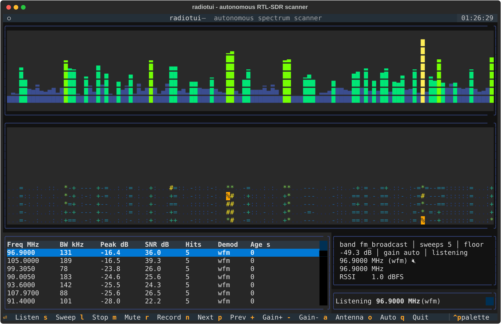

# radiotui

<p align="center">
  
</p>

Autonomous spectrum scanner for the RTL-SDR v3 with a terminal UI. It sweeps
bands on its own, estimates the noise floor, flags frequencies that show
"life", lets you listen and record them, and helps you place your antenna.

## Features

- **Sweep engine** — hops across any frequency range, computes an averaged PSD
  (FFT) per hop and stitches a full-range power spectrum.
- **Automatic squelch** — rolling noise-floor estimation (median + percentile)
  with persistence tracking: a channel only becomes "active" after it stays
  above the floor for several consecutive frames.
- **Terminal UI** — live bar spectrum, scrolling waterfall, active-channel
  table, signal meter, keyboard controls.
- **Listen & record** — NFM / WFM / AM demodulation in numpy, playback through
  `ffplay`/`aplay`, VOX-gated WAV recording of transmissions.
- **Autonomous scan-and-hold** (`o` in the TUI, `--autonomous` headless) —
  when a channel crosses the activation gate the scanner pauses its sweep,
  VOX-records transmissions on that frequency and releases back to sweeping
  after a few seconds of silence, with per-channel cooldown.
- **Hardware controls** — bias tee (~4.5 V for LNAs / active antennas),
  PPM crystal correction and optional LO-offset tuning.
- **HF coverage** — bands below 24 MHz automatically switch the v3 into
  direct-sampling Q-branch mode (500 kHz - 28.8 MHz).
- **Antenna advisor** — wavelength math (quarter-wave, dipole legs in cm),
  band-specific antenna/orientation recommendations, and a live tuner mode
  with a big signal bar for physically optimizing your setup.
- **Simulator** — no dongle plugged in? A synthetic device generates realistic
  carriers and bursts so every feature is demoable and testable.

## Install

```bash
uv sync --group dev            # core (simulator mode)
uv sync --group dev --extra sdr  # + pyrtlsdr for real hardware
```

You also need the RTL-SDR userspace tools or at least `librtlsdr` on your
system for real hardware (`sudo apt install rtl-sdr`), plus `ffmpeg` for audio
playback (optional; falls back to `aplay`).

### Linux hardware setup (validated on Ubuntu 24.04)

```bash
sudo apt install rtl-sdr ffmpeg   # librtlsdr userspace + audio playback
```

The DVB-T kernel driver (`dvb_usb_rtl28xxu`) claims the dongle by default.
librtlsdr detaches it automatically on each open (you'll see
`Detached kernel driver` on stderr), so no reboot is needed after dropping a
blacklist file; to make it permanent:

```bash
echo 'blacklist dvb_usb_rtl28xxu' | sudo tee /etc/modprobe.d/blacklist-dvb_usb_rtl28xxu.conf
```

**Ubuntu/Debian quirk:** the distro `librtlsdr2` package (2.0.1) lacks symbols
that `pyrtlsdr` requires at import time (`rtlsdr_set_dithering`, GPIO helpers,
`rtlsdr_set_and_get_tuner_bandwidth`), so `import rtlsdr` fails with
`AttributeError: undefined symbol`. Fix without touching system packages by
building a tiny forwarder library and putting it first on the loader path:

```bash
mkdir -p ~/.local/lib/rtlsdr-shim && cd ~/.local/lib/rtlsdr-shim
cat > shim.c <<'EOF'
/* Forwarder: adds symbols missing from Ubuntu's librtlsdr2 (2.0.1).
   Real functionality comes from the DT_NEEDED system library;
   dithering/GPIO stubs are functional no-ops (bias-tee still works,
   the system build exports rtlsdr_set_bias_tee). */
int rtlsdr_set_dithering(void *dev, int on) { (void)dev; (void)on; return 0; }
int rtlsdr_set_gpio_output(void *dev, unsigned char g) { (void)dev; (void)g; return 0; }
int rtlsdr_set_gpio_input(void *dev, unsigned char g) { (void)dev; (void)g; return 0; }
int rtlsdr_set_gpio_bit(void *dev, unsigned char g, int v) { (void)dev; (void)g; (void)v; return 0; }
unsigned char rtlsdr_get_gpio_bit(void *dev, unsigned char g) { (void)dev; (void)g; return 0; }
int rtlsdr_set_gpio_byte(void *dev, int v) { (void)dev; (void)v; return 0; }
unsigned char rtlsdr_get_gpio_byte(void *dev) { (void)dev; return 0; }
int rtlsdr_set_gpio_status(void *dev, unsigned char *b) { (void)dev; if(b)*b=0; return 0; }
int rtlsdr_set_and_get_tuner_bandwidth(void *dev, unsigned long bw,
                                       unsigned long *applied, int apply) {
    (void)dev; (void)bw; (void)apply; if(applied)*applied=0; return 0; }
EOF
gcc -shared -fPIC -Wl,-soname,librtlsdr.so -Wl,--no-as-needed \
    -o librtlsdr.so shim.c -l:librtlsdr.so.2 -Wl,-rpath,/lib/x86_64-linux-gnu
echo 'export LD_LIBRARY_PATH="$HOME/.local/lib/rtlsdr-shim${LD_LIBRARY_PATH:+:$LD_LIBRARY_PATH}"' >> ~/.bashrc
```

Then verify with `radiotui devices`.

### Measured performance (RTL-SDR v3, R820T, indoor dipole)

| Metric | Value |
| --- | --- |
| Device detection | `Realtek RTL2838UHIDIR SN 00000001`, works as non-root user |
| FM broadcast sweep (27 hops) | ~9 s/sweep (~3 hops/s), USB-limited |
| Simulated sweep | ~50 hops/s (no USB latency) |
| Real noise floor | −49 dB @ gain 28 dB (simulator baseline: −62 dBFS); default threshold margin works unmodified |
| DC spike | masked automatically around every hop center (±3% of sample rate, real devices only); no phantom channels observed |
| Audio playback | `aplay` fallback works without ffmpeg |
| Recordings | WAV clips land in `recordings/` (48 kHz mono PCM16) |

### HF direct sampling — notes and gotchas

- Switching into a band below 24 MHz enables `set_direct_sampling(2)`
  (Q-branch) automatically; switching back to VHF/UHF disables it.
- **Sample rate is forced to 28.8 MHz / 115 ≈ 250.43 kS/s in HF mode.**
  Sync reads at ~1 MS/s in direct-sampling mode overflow the USB ring buffer
  (`LIBUSB_ERROR_OVERFLOW`) on this host. 250 kS/s is rock solid and still
  far wider than any HF channel.
- **Sync reads are aligned to multiples of 256 samples** inside
  `RtlSdrDevice.read_samples`: the RTL2832 bulk endpoint overruns unless
  transfer lengths are multiples of 512 bytes.
- Validated live: shortwave broadcast carriers at 9.815 / 11.765 / 11.910 MHz
  detected with the stock indoor dipole; AM listen works.

### Crystal PPM calibration

`rtl_test -p` is noisy on this host because of USB sample losses
(cumulative −70 ppm, per-window values −106…+320). FM carrier centroids gave
station-dependent results (+6…−22 ppm) because broadcast modulation skews the
centroid. Practical guidance: start with the cumulative `rtl_test -p` value,
then refine against a known narrowband reference (DAB or GSM downlink) if you
need sub-kHz accuracy. `--offset-tune` is exposed but **reports "unsupported"
on Ubuntu's librtlsdr2 2.0.1** even via raw symbol calls — the automatic DC
masking makes it unnecessary anyway.

## Usage

```bash
radiotui                       # launch the TUI (auto-detects device)
radiotui scan                  # headless sweep, prints live table
radiotui scan --band airband   # presets: hf_broadcast, hf_ham_40m, hf_ham_80m,
                               # fm_broadcast, airband, vhf_ham, vhf_marine,
                               # pmr446, uhf_ham
radiotui scan --autonomous     # sweep + auto-hold + VOX record live channels
radiotui listen 145.500e6      # tune + demodulate + play
radiotui listen 96.9e6 --bias-tee   # power an LNA while listening
radiotui record 446.00625e6    # VOX-record transmissions to WAV
radiotui scan --ppm -70        # correct crystal error (see measurement below)
radiotui antenna 145.500e6     # antenna advisor report
radiotui tuner                 # live signal bar to optimize the antenna
radiotui devices               # list detected SDR hardware
```

Hardware flags `--bias-tee`, `--ppm N` and `--offset-tune` work on every
command (scan / listen / record / tuner / tui). Bands starting below 24 MHz
switch into HF direct sampling automatically.

### TUI keys

| Key | Action |
| --- | --- |
| `s` | start / stop sweeping |
| `enter` | listen to selected channel |
| `l` | stop listening |
| `m` | mute / unmute |
| `r` | record selected channel |
| `n` / `p` | jump to next / previous active channel |
| `+` / `-` | gain up / down |
| `a` | antenna advisor for selected channel |
| `o` | autonomous scan-and-hold on / off |
| number keys | jump between band presets (1-9) |
| `q` | quit |

## Layout

```
src/radiotui/
├── config.py     band presets, settings
├── sdr/          device abstraction: real RtlSdr + simulator
├── dsp/          FFT PSD, noise floor, peak detection/tracking
├── scanner/      async sweep loop, channel monitor
├── audio/        demodulators, player, VOX recorder
├── antenna/      wavelength math + recommendations
└── tui/          Textual app and widgets
```
